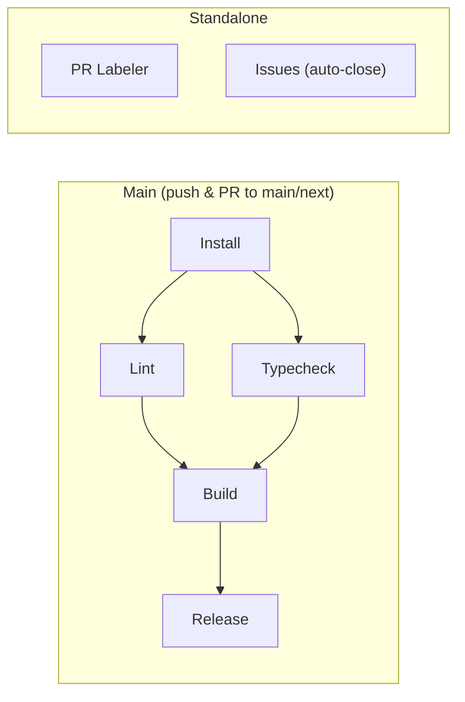

# CI / CD

## Overview

## Workflow summary

| Workflow | File | Trigger | Blocks merge? |
|----------|------|---------|:---:|
| **Main** | [`main.yml`](workflows/main.yml) | Push / PR to `main`, `next` | Yes |
| **PR Labeler** | [`labeler.yml`](workflows/labeler.yml) | PR opened | No |
| **Issues** | [`issues.yml`](workflows/issues.yml) | Issue opened | No |

---

## Main (`main.yml`)

Quality gate for every push and PR targeting `main` or `next`. Cancels in-progress runs on the same ref.

**Job chain:**

1. **Install** — checkout, pnpm cache, `pnpm install --frozen-lockfile`
2. **Lint** (needs install) — `pnpm lint.check` (Biome)
3. **Typecheck** (needs install) — `pnpm type.check`
4. **Build** (needs lint + typecheck) — `pnpm build`
5. **Release** (needs build, `main` push only) — Changesets action: creates release PR or tags

Lint and typecheck run in parallel; build runs once both pass. Release only triggers on push to `main`.

---

## PR Labeler (`labeler.yml`)

Auto-labels PRs based on changed files using `actions/labeler`.

---

## Issues (`issues.yml`)

Collaborator gate. When an issue is opened, checks author permission level. Non-collaborators (below `write`) get the issue auto-closed as "not planned".

---

## Configuration

### Renovate ([`renovate.json5`](renovate.json5))

- Schedule: quarterly (1st of every 3rd month)
- Range strategy: `pin` (exact versions)
- Auto-merge: minor + patch (grouped into one PR)
- Manual review: major updates
- Ignored: `@biomejs/biome`, `node`, `pnpm`
- Post-update: `pnpmDedupe`

---

## Runtime

All workflows use Node and pnpm versions pinned in `package.json`.
